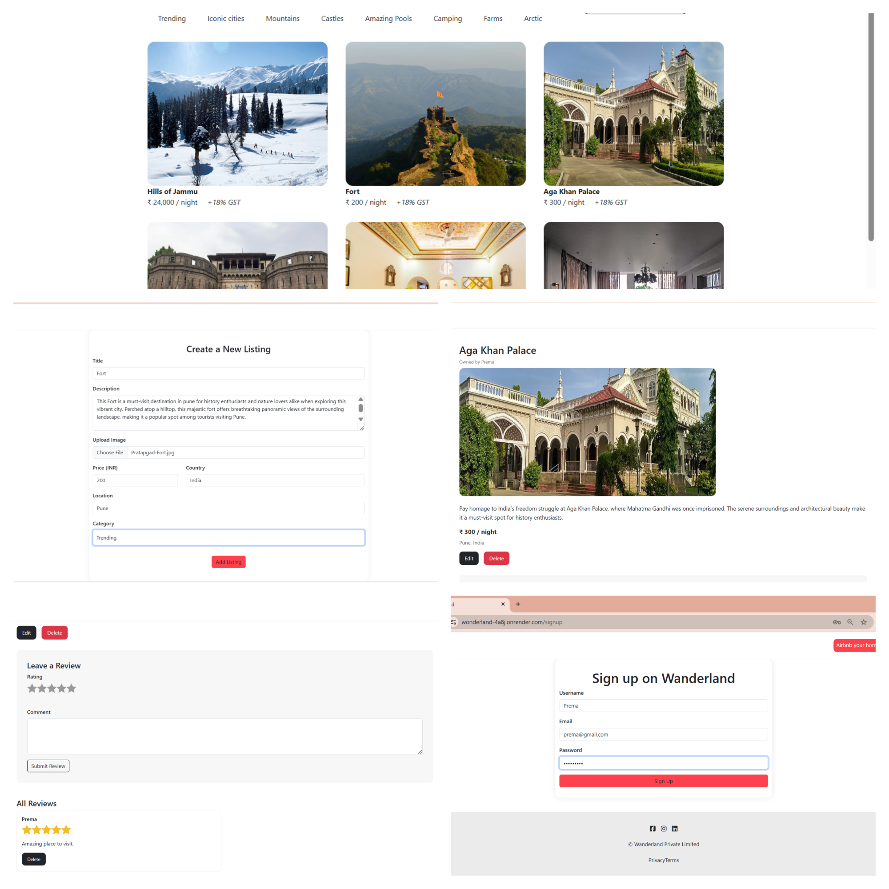

# 🌍 Wonderland - Travel Listing Web App

Wonderland is a full-stack travel listing web app inspired by Airbnb 🌐.  
It allows users to explore places, post property listings, leave reviews etc.

## 🚀 Live Demo

- 🌐 **Website**: [https://wonderland-4a8j.onrender.com/listings](#)  

## ✨ Features

- 🔐 User Authentication (Login, Register)
- 📌 Add, Edit & Delete Listings
- 🖼️ Image Upload with Cloudinary
- ⭐ Review & Rating System
- 💡 Flash Messages & Error Handling
- 📱 Responsive Design with Bootstrap

## 🛠️ Tech Stack

- **Frontend:** HTML, CSS, Bootstrap, EJS
- **Backend:** Node.js, Express.js
- **Database:** MongoDB (Mongoose)
- **Other Tools:** Cloudinary, Passport.js, Multer, Dotenv

## 📸 Demo

